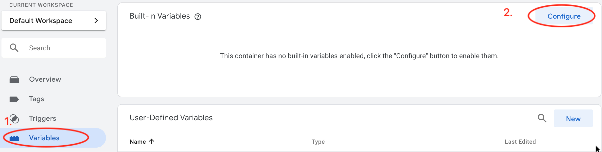
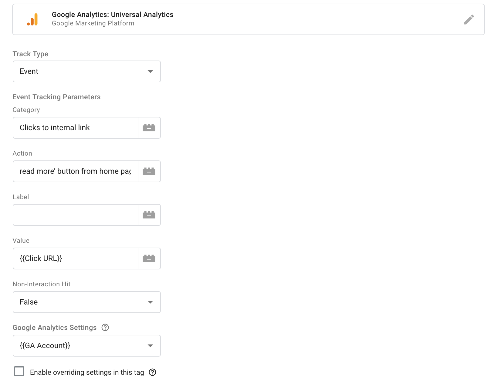
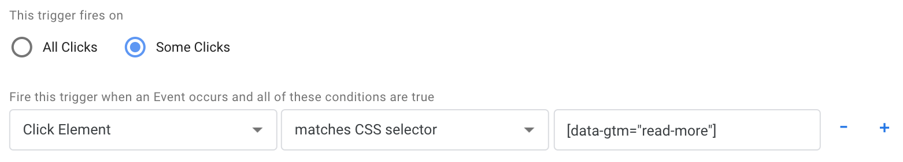
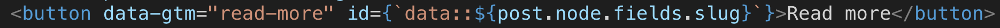
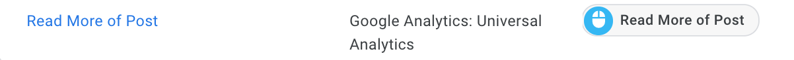
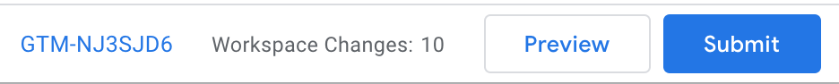
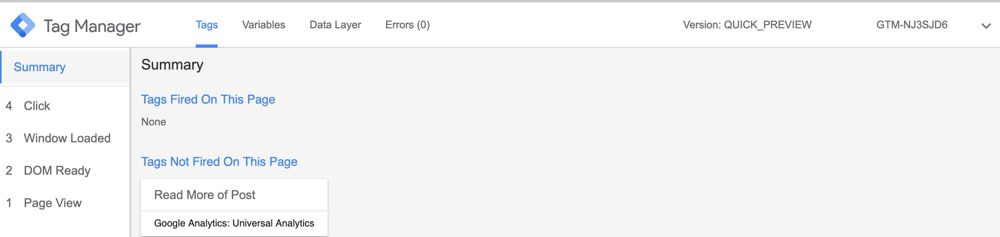
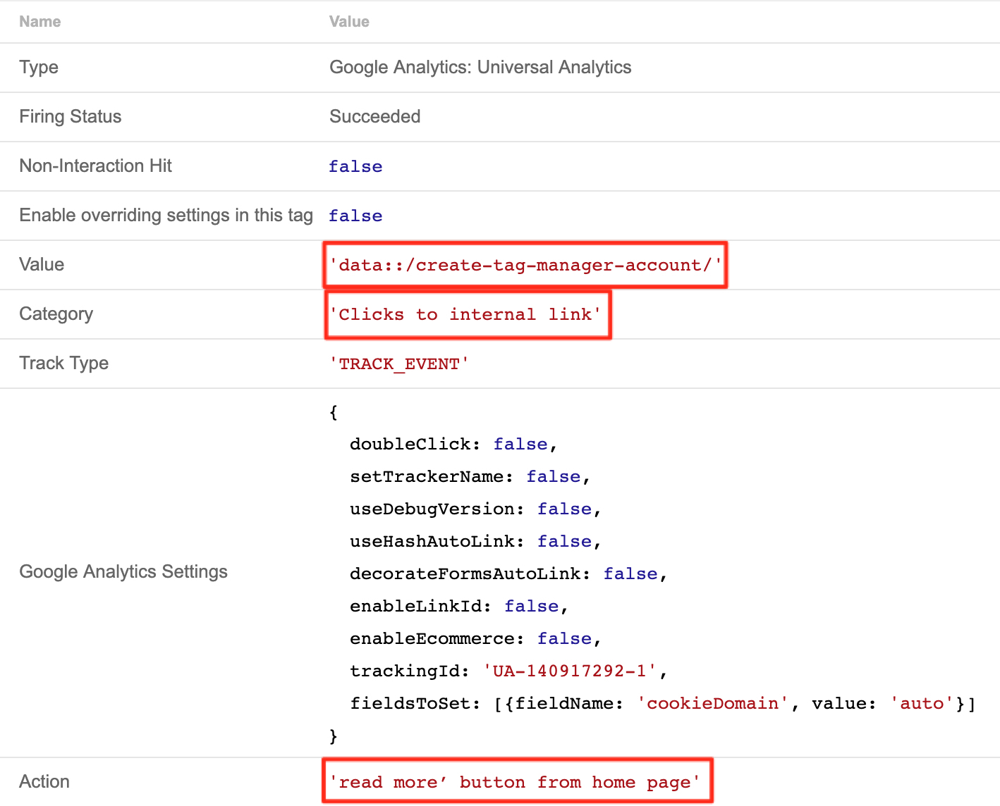

Tag Manager is an incredibly useful tool for tracking events on your site. The only problem is, if you’ve never used it before, it isn’t very clear how to use it or how to tie all the pieces together. I know it took me a good amount of experimenting before I reached a point where the setup started to make sense to me. If you don’t already have a Tag Manager account I recommend reading [Setting Up a Tag Manager Account](http://www.rachellerathbone.com/create-tag-manager-account). You’ll also need to make sure you have a Google Analytics account as GA is where you’ll be able to view all the data created by your Tag Manager Tag.

Navigate to the Tag Manager Dashboard so that we can walk through the 3 following steps:
Configuring Built-In Variables and Creating a New Variable
Creating Our First Tag
Creating Our First Trigger

I’ll be walking through the flow using a blog I created for [LINK TO COURSE]. If you’re taking the course you’ll simply be able to do exactly as I do - we’ll be adding an event to the ‘Read more’ buttons so we can track the number of users who navigate their way to a post from the home page. For those of you who have organically found your way here, the process should be pretty easy to modify to something on your own site that you would like to track.

 

###Configuring Built-In Variables and Creating a New Variable
Tag Manager comes with a number of built-in variables that you can utilize to easily track events on your site. However, in order to use any of them for a tag or a trigger, they first need to be activated. In order to do this, select ‘Variables’ from the panel on the left side of the screen and then click ‘Configure’.

Over time you may begin to use a number of the variable options available to you but for the purpose of this video we are going to select two: `Click Element` and `Click ID`.

Back in the Variables dashboard, click the 'New' button in the 'User-Defined Variables' box. Name the variable 'GA Account' and then click anywhere within the 'Variable Configuration' box. When the panel pops out on the right, scroll down until you see 'Google Analytics Settings' and click on that. Get your Google Analytics tracking ID from you GA account (or from our gatsby-config file is you're doing my course) and hit save.

 

###Creating Our First Tag
From the panel on the left select ‘Tags’ and then click the ’New’. Replace ‘Untitled Tag’ with whatever you think is an appropriate name for your tag. For anyone taking the Gatsby course, we’re going to call our tag ‘Read More of Post’. Once you’ve done that, click anywhere on the white box ‘Tag Configuration’ and when the panel slides out, select ‘Google Analytics: Universal Analytics’.

If you’ve never used Tag Manager before, this is the part where it gets easy to get lost. There’s no docs, there’s no examples, so you’re basically left to stumble around on your own trying to figure out what goes where. Luckily for you, I’ve already spent that time banging my head against a wall and am here to help!

From the ‘Track Type’ dropdown, select event. You’ll see several input fields. We’ll start by dealing with the dropdowns and then come back to the input fields. Leave ‘Non-Interaction Hit’ set to false, then click on the dropdown for ‘Google Analytics Settings’ and select the `{{GA Account}}` variable that we created earlier.

As for the input fields, you can basically put whatever you want in these fields. After you become familiar with Tag Manager you’ll most likely settle on your own way of structuring these fields but this is what I’ve found works for me:
- **Category**: for this field you’ll want to select something that is an ‘umbrella’. Meaning, you want to be able to group events on your site into, well, categories. For example, the event we’ll be tracking in this example is a click event whereby a user clicks through to another page on our site. We don’t want each internal link to have it’s own category so it makes sense to put this event into a category called: ‘Clicks to internal link’. One thing to note here, Tag Manager is case sensitive so if you created an event at some point down the road and gave it the category ‘clicks to internal link’, when you checked the data in Google Analytics, you’d have some events falling into ‘Clicks to internal link’ and others into ‘clicks to internal link’.
- **Action**: here we want to give a concise description of the action that we expect the user to take. For this example, let’s add ‘read more’ button from home page’.
- **Label**: I typically use this input to track the page url so I know where the event was fired from. For this particular use case, however, we are going to leave this blank. We know this event will only be fired from the home page so tracking the url here would be redundant.
- **Value**: I vary what goes on this field depending on what I want to pass through to Google Analytics. In the case of our ‘Read more’ button, we are going to use `{{CLICK ID}}` and add an id attribute to our button, set to `id={`data::${post.node.fields.slug}`}` so we know which posts users have clicked through to. A better option here would be to use `{{Click URL}}` instead of an id or class as this would make our tag less brittle. Unfortunately, with the way our button is sitting inside the Gatsby Link component, we don’t have access to the url from the button itself and if we move our data-gtm attribute to the Link element itself, the tag will only fire if a user clicks directly on the words ‘Read more’. Using classes and ids for tracking isn’t the best practice because there is potential for these to be accidentally removed during a refactor if someone checks the class/id and doesn’t see it being used for styling. However, sometimes using ids and classes are necessary but at least try to indicate in some way that it’s being used for something other than styling. This is why we’ve prefixed our ID with ‘data::’. Fortunately, if our ID was deleted at some point our tag wouldn’t break but we would lose some of the data we were hoping to collect.

You’re tag should look like this:

Hit save and, when the modal pops up, click ‘Add Trigger’, followed by the + sign.

Creating Our First Trigger
Start by naming your trigger with the same name you used for your tag: ‘Read More of Post’. You may not always follow this convention but it’s what we are doing in this instance. Click anywhere inside the ‘Tag Configuration’ box and from the panel that slides out select ‘All Elements’.

From the next screen click on ‘Some Clicks’ and then do the following:
First dropdown: Click Element
Second dropdown: matches CSS selector
Input: [data-gtm="read-more"]

I recommend using this convention for your triggers whenever possible. Usually, if a developer see’s an HTML attribute prefixed with `data-` they know it’s being used for tracking or testing and won’t just go ahead and delete it. On the other hand, if you were to use a class name or ID here, you run the risk of it being removed during a code clean up, as I mentioned earlier. However, unlike simply losing a little bit of data from one field like in the case of our tag, if your trigger was relying on an ID or class name that was deleted, the trigger would stop firing and you would lose all data for that event.

Currently we don’t have any data-gtm tags in our code so take a moment to go to your text editor and that to the element you need to attach it to. For anyone doing the Gatsby course, you’ll want to add that to the ‘Read more’ button in `pages/index.js`.

Click save. When that view collapses click save for the tag. Back in the dashboard view you should see the following:

If you can’t see the trigger listed trying refreshing your page and it should show up.

 

###Testing the Trigger

Make sure your app is running and then click ‘Preview’ from the dashboard view in Tag Manager.

When you go to your app in the browser you should see the Tag Manager console with our new tag listed under ‘Tags Not Fired On This Page’:

Now all you need to do is test out the trigger by taking the action you want your users to take. For my Gatsby course followers, simply click one of the ‘Read more’ buttons. What you should see the tag move up under ‘Tags Fired On This Page’. If you then click on the tag and then show more you should see:

When you ship your changes you’ll be able to start following the event data you’re collecting in Google Analytics. One thing to note: GA will not display data for the day of. So if you have a day where you’re expecting to see a lot of traffic, an increase in a particular event being fired etc. you’ll have to wait until the following day before you can view any of that data.

 

###Submitting Your Changes in Tag Manager
To see your changes take affect in the real world, head back to the Tag Manager dashboard, click 'Leave Preview Mode' under the orange box and then hit the blue submit button. Add whatever you feel is appropriate in the version name and description fields and then click 'Submit'. That’s all there is to it!

I hope you now have a good understanding of how to put tags and triggers together to get data about events you want to track on your site. Happy tracking :)
